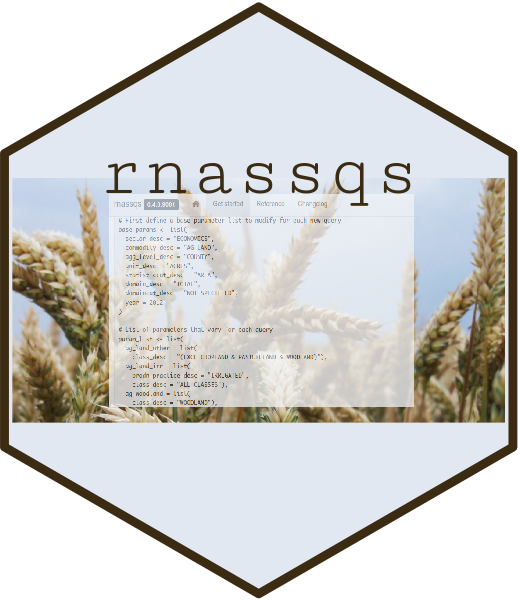

<!-- README.md is generated from README.Rmd. Please edit that file -->

<table class="table">

<thead>

<tr class="header">

<th align="left">

rnassqs

</th>

<th align="left">

Usage

</th>

<th align="left">

Release

</th>

<th align="left">

Development

</th>

</tr>

</thead>

<tbody>

<tr class="odd">

<td rowspan="5">



(Wheat image from
[here](https://www.flickr.com/photos/53018729@N00/2669034542))

</td>

<td align="left">

<a href="http://choosealicense.com/licenses/mit/"></a>

</td>

<td align="left">

<a href="https://cran.r-project.org/package=rnassqs"></a>

</td>

<td align="left">

<a href="https://github.com/ropensci/rnassqs/commits/master"></a>

</td>

</tr>

<tr class="even">

<td align="left">

<a href="https://CRAN.R-project.org/package=rnassqs"></a>

</td>

<td align="left">

<a href="https://zenodo.org/badge/latestdoi/37335585"></a>

</td>

<td align="left">

<a href="https://travis-ci.org/ropensci/rnassqs"></a>

</td>

</tr>

<tr class="odd">

<td align="left">

</td>

<td align="left">

<a href="https://github.com/ropensci/onboarding/issues/298" alt="rOpensci reviewed!"></a>

</td>

<td align="left">

<a href="https://codecov.io/gh/ropensci/rnassqs"></a>

</td>

</tr>

<tr class="even">

<td align="left">

</td>

<td align="left">

<a href="https://orcid.org/0000-0002-3410-3732"></a>

</td>

<td align="left">

<a href="https://www.repostatus.org/#active"></a>

</td>

</tr>

<tr class="even">

<td align="left">

</td>

<td align="left">

</td>

<td align="left">

<a href="https://www.tidyverse.org/lifecycle/#maturing"></a>

</td>

</tr>

</tbody>

</table>

<br>

## rnassqs (R NASS Quick Stats)

`rnassqs` allows users to access the USDA’s National Agricultural
Statistics Service (NASS) ‘Quick Stats’ data through their API. It is
simple and easy to use, and provides some functions to help navigate the
bewildering complexity of some Quick Stats data.

For docs and code examples, visit the package web page here:
<https://ropensci.github.io/rnassqs/>.

## Installing

Install the package via `devtools` or CRAN:

``` r
    # Via devtools
    library(devtools)
    install_github('ropensci/rnassqs')
    
    # Via CRAN
    install.packages("rnassqs")
```

## API Key

To use the NASS Quick Stats API you need an [API
key](http://quickstats.nass.usda.gov/api). The API key should in general
not be included in scripts. One way of making the key available without
defining it in a script is by setting it in your `.Renviron` file, which
is usually located in your home directory. If you are an `rstudio` user,
you can use `usethis::edit_r_environ()` to open your `.Renviron` file
and add a line that looks like:

``` r
    NASSQS_TOKEN="<your api key here>"
```

Alternatively, you can set it explicitly in the console with
`nassqs_auth(key = <your api key>)`. This will set the environmental
variable NASSQS\_TOKEN, which is used to access the API. You can also
set this directly with `Sys.setenv("NASSQS_TOKEN" = <your api key>)`.

## Usage

See the examples in [inst/examples](inst/examples) for quick recipes to
download data.

The primary function is `nassqs()`, with which you can make any query of
variables. For example, to mirror the request that is on the [NASS API
documentation](http://quickstats.nass.usda.gov/api), you can use:

``` r
    library(nassqs)
    
    # You must set your api key before requesting data
    nassqs_auth(key = <your api key>)
    
    # Parameters to query on and data call
    params <- list(commodity_desc = "CORN", year__GE = 2012, state_alpha = "VA")
    d <- nassqs(params)
```

Parameters **do not** need to be capitalized, and also do not need to be
in a list format. The following works just as well:

``` r
    d <- nassqs(commodity_desc = "corn", year__GE = 2012, state_alpha = "va")
```

You can request data for multiple values of the same parameter by using
a simple list as follows:

``` r
    params <- list(commodity_desc = "CORN", year__GE = 2012, state_alpha = c("VA", "WA"))
    d <- nassqs(params)
```

NASS does not allow GET requests that pull more than 50,000 records in
one request. The function will inform you if you try to do that. It will
also inform you if you’ve requested a set of parameters for which there
are no records.

Other useful functions include:

``` r
    # returns a set of unnique values for the parameter "STATISTICCAT_DESC"
    nassqs_param_values("statisticcat_desc")
    
    # returns a count of the number of records for a given query
    nassqs_record_count(params=params)
    
    # Get yields specifically
    # Equivalent to including "'statisticat_desc' = 'YIELD'" in your parameter list. 
    nassqs_yields(params)
    
    # Get acres specifically
    # Equivalent to including all "AREA" values in statisticcat_desc
    nassqs_acres(params)
    
    # Specifies just "AREA HARVESTED" values of statisticcat_desc
    nassqs_acres(params, area = "AREA HARVESTED")
```

### Handling inequalities and operators other than “=”

The NASS API handles other operators by modifying the variable name. The
API can accept the following modifications:

  - \_\_LE: \<=
  - \_\_LT: \<
  - \_\_GT: \>
  - \_\_GE: \>=
  - \_\_LIKE: like
  - \_\_NOT\_LIKE: not like
  - \_\_NE: not equal

For example, to request corn yields in Virginia and Pennsylvania for all
years since 2000, you would use something like:

``` r
    params <- list(commodity_desc = "CORN", 
                  year__GE = 2000, 
                  state_alpha = c("VA", "PA"), 
                  statisticcat_desc = "YIELD")
    df <- nassqs(params) #returns data as a data frame.
```

See the
[vignette](https://ropensci.github.io/rnassqs/articles/rnassqs.html) for
more examples and details on usage.

## Contributing

Contributions are more than welcome, and there are several ways to
contribute:

  - Examples: More examples are always helpful. If you use `rnassqs` to
    query data from ‘Quick Stats’ and would like to contribute your
    query, consider submitting a pull request adding your query as a
    file in
    [inst/examples/](https://github.com/ropensci/rnassqs/tree/master/inst/examples).
  - File an issue: If there is functionality you’d like to see added or
    something that is confusing, consider [creating an
    issue](https://github.com/ropensci/rnassqs/issues/new). The best
    issue contains an example of the problem or feature. Consider the
    excellent package [reprex](https://github.com/tidyverse/reprex) in
    creating a reproducible example.
  - Contributing documentation: Clarifying and expanding the
    documentation is always appreciated, especially if you find an area
    that is lacking and would like to improve it. `rnassqs` uses
    roxygen2, which means the documentation is at the top of each
    function definition. Please submit any improvements as a pull
    request.
  - Contributing code: if you see something that needs improving and
    you’d like to make the changes, contributed code is very welcome.
    Begin by filing a new issue to discuss the proposed change, and then
    submit a pull request to address the issue. `rnassqs` follows the
    style outlined in Hadley Wickham’s [R
    Packages](http://r-pkgs.had.co.nz/style.html). Following this style
    makes the pull request and review go more smoothly.

## Alternatives

In June 2019 the `usdarnass` package was released on
[CRAN](https://cran.r-project.org/package=usdarnass) and is also
available to install via [github](https://github.com/rdinter/usdarnass).
`usdarnass` has similar functionality to this package.

NASS also provides a daily tarred and gzipped file of their entire
dataset. At the time of writing it is approaching 1 GB. You can download
that file via their [FTP site](ftp://ftp.nass.usda.gov/quickstats).

The FTP link also contains builds for: NASS census (every 5 years ending
with 2 and 7), or data for one of their specific sectors (CROPS,
ECONOMICS, ANIMALS & PRODUCTS). At the time of this writing, specific
files for the ENVIRONMENTAL and DEMOGRAPHICS sectors are not available.

### Acknowledgements

Thank you to rOpensci reviewers Adam Sparks and Neal Richardson and
editor Lincoln Mullen, for their fantastic feedback and assistance. User
feedback and use case contributions have been a huge help to make
`rnassqs` more accessible and user-friendly. More use cases or feature
requests are always welcome\!

[](https://ropensci.org)
